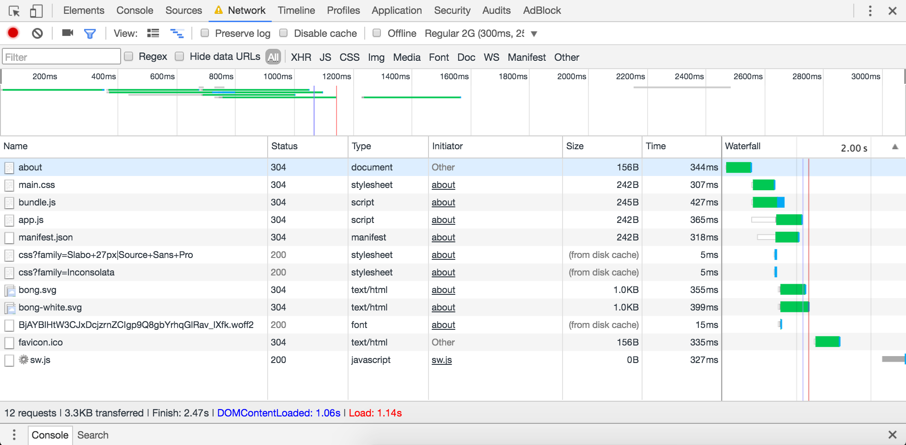

# Performance Audit

I'm using NPM as a build tool and Browserify for optimization.

**First state**

Tested on: ``Regular 2G(300ms, 250kb/s, 50kb/s)``

Without caching...

**Before:**

- many requests
- big blocking scripts
- no critical css
- blocking css

``Load: 17.11s``


**Page Insights**


## Compression & Eliminating render-blocking CSS & adding Browserify

**After:**

- bundled javascript files
- added critical css
- load javascript async
- added Gzip compression

Results:

```Load: 1.14s```



**Page Insights**


### Service worker - Caching

```Load: 138ms```

After adding service worker (using caching).


### To do: resize images on the server?


